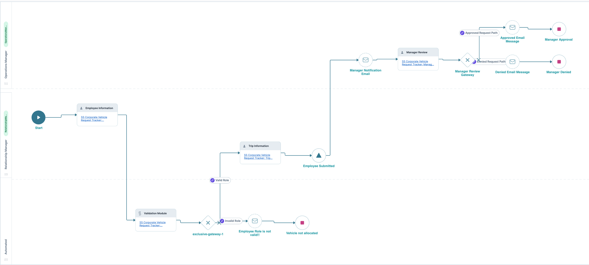

# Unqork Corporate Vehicle Request Tracker 🚗
**Novice Badge Certification Project** 
This repository contains the Corporate Vehicle Request Tracker, an application built in Unqork as part of the Novice Badge Certification Exam. The application is designed to manage corporate vehicle requests submitted by employees, with an approval process managed by operations.

# 📌 Project Overview
**The Corporate Vehicle Request Tracker allows:** 
• Employees to submit vehicle requests by providing trip details. 
• The system to validate the request and ensure compliance. 
• Operations Managers to review, approve, or reject requests. 
• A dashboard to track submitted requests with key performance indicators. 

# 🏗 Application Structure
This project was built using Unqork **Workflow Builder** and consists of five modules:
| **Module**             | **Purpose**                                                              |
|------------------------|------------------------------------------------------------------------|
| **Employee Information** | Captures employee details, including role, driving history, and trip purpose. |
| **Validation Module**   | Ensures the request is valid (e.g., rejecting Clients from proceeding). |
| **Trip Information**    | Collects trip details, such as origin, destination, and vehicle type.  |
| **Manager Review**      | Allows Operations Manager to approve or reject the request.           |
| **Dashboard**           | Displays submitted requests and KPI metrics for tracking.            |

# ⚙️ Workflow Implementation
The project workflow consists of: 

• **Three Swimlanes:** RelationshipManager, Automated, OperationsManager 
• **Decision Gateways** for validation 
• **Message Nodes** for email notifications 
• **Signal Nodes** for request closure 

 
📸 Workflow Diagram
  

# ✅ Certification & Grading 
This project meets all Novice Badge Exam grading criteria, as confirmed by the rubric. 

✔ Component IDs follow camelCase 
✔ Correct field types and property IDs used 
✔ Workflow structure meets specifications 
✔ Dashboard includes required fields and KPI widget 

# 🚀 How to Run 
1. Import the JSON files into an Unqork workspace. 
2. Verify the Workflow & Modules in Unqork Designer. 
3. Test Submissions using the Employee and Operations Manager roles. 
4. Validate Email Notifications (ensure correct email configurations). 
5. Check the Dashboard for submitted requests. 

